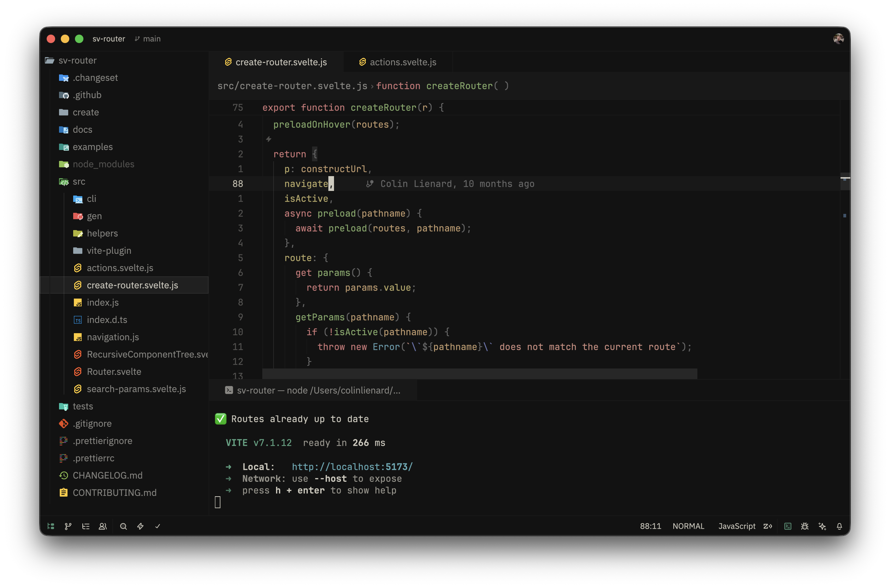
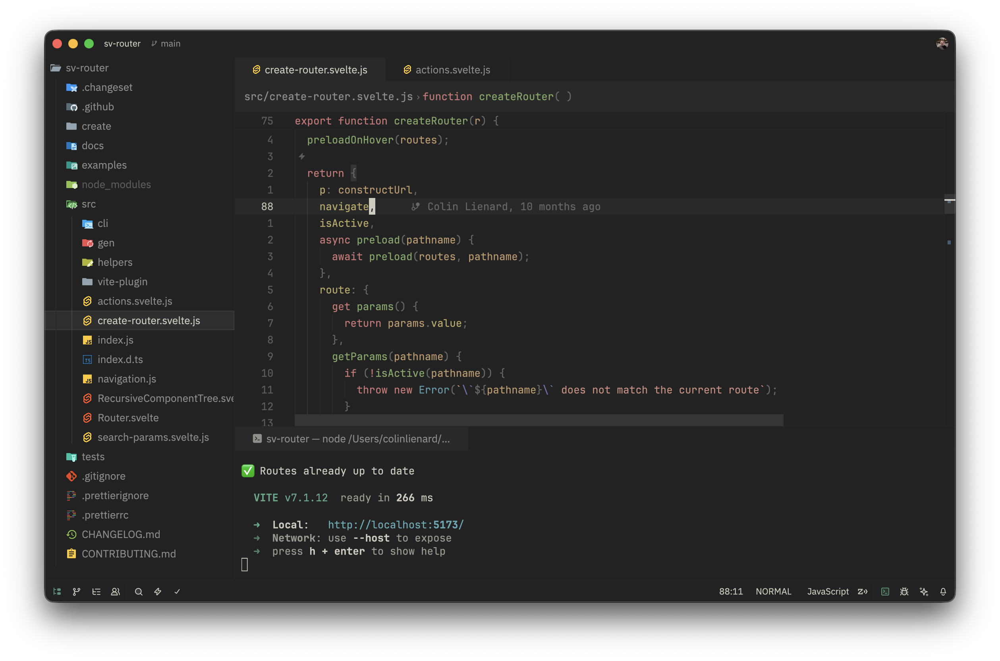
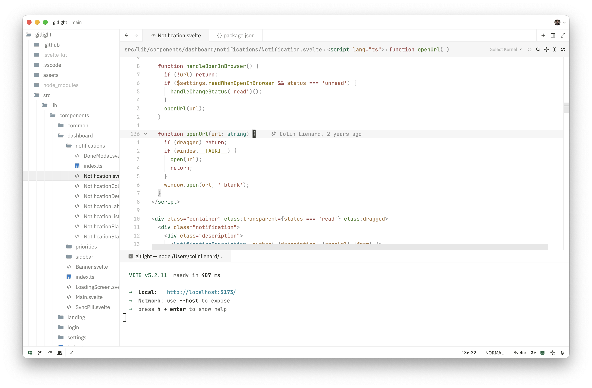
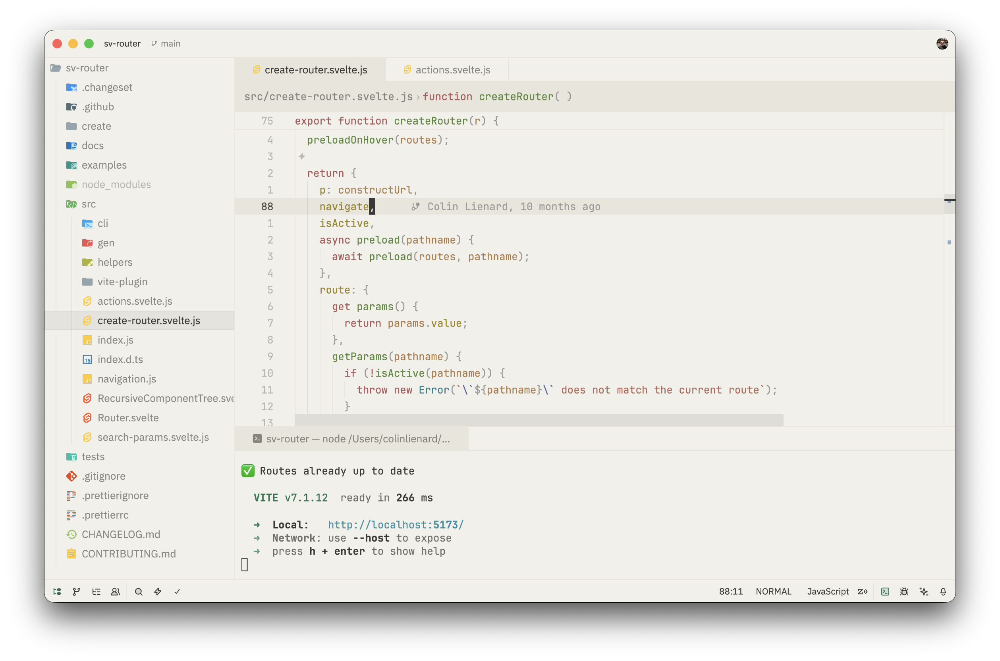
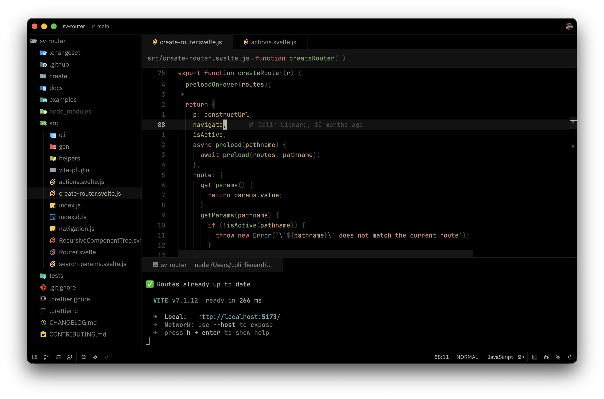

<div align="center">

# Zed Vitesse Theme Refined


[](https://zed.dev/extensions/vitesse-theme-refined)

</div>

Zed Vitesse Theme Refined is a port of the [Vitesse theme for VSCode](https://github.com/antfu/vscode-theme-vitesse) to the Zed editor.

This refined version addresses the limitations of the auto-generated Vitesse theme on Zed, correcting color inaccuracies and filling in missing colors.

---

<div align="center">

### Dark



### Dark Soft



### Light



### Light Soft



### Black



</div>

---

## Development

```sh
bun install

bun build
# or
bun watch
```

## License

[MIT](./LICENSE) © Colin Lienard
